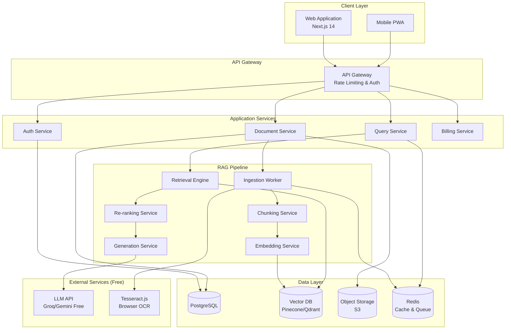
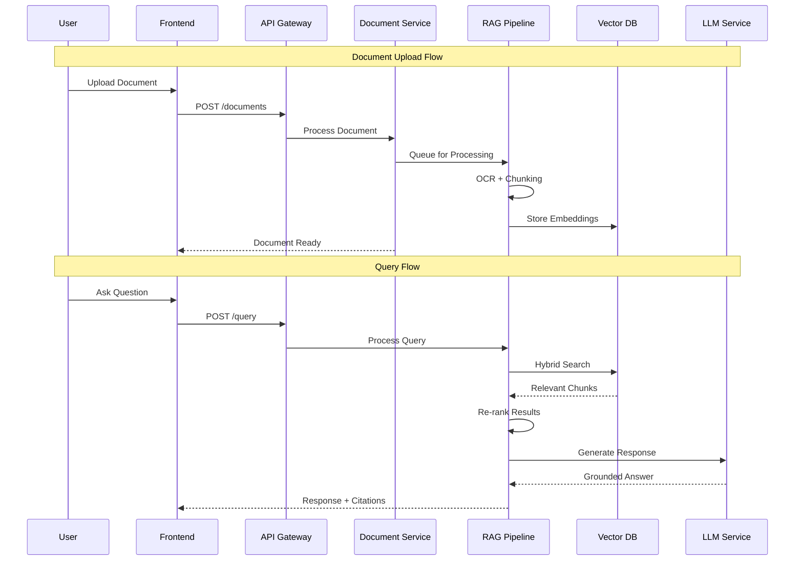
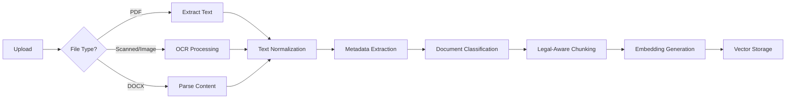
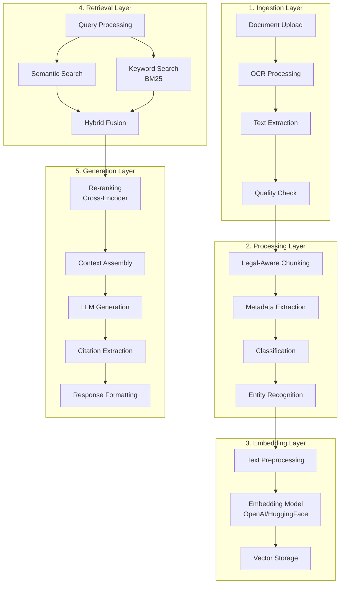
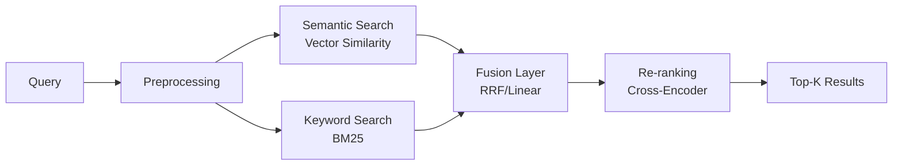
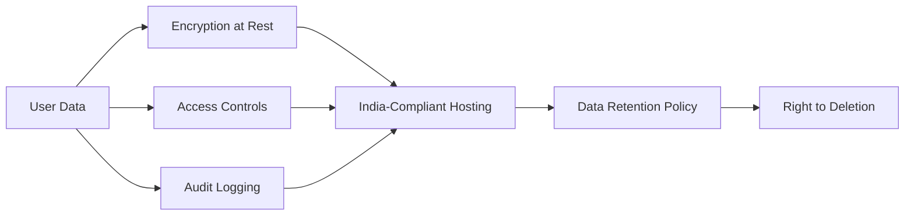
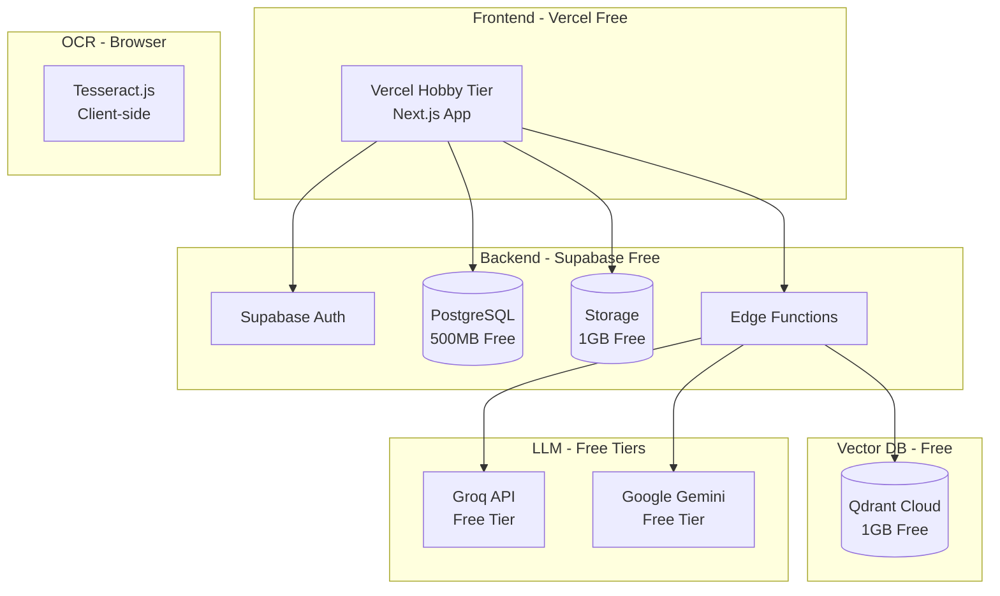
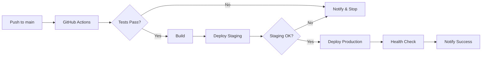

# PatraSaar - System Design Architecture & Implementation Plan

> **Legal clarity, distilled.**  
> A comprehensive AI-powered platform for simplifying Indian legal documents using Retrieval-Augmented Generation (RAG).

---

## Table of Contents
1. [Executive Summary](#1-executive-summary)
2. [System Architecture Overview](#2-system-architecture-overview)
3. [Component Deep Dive](#3-component-deep-dive)
4. [Data Models & Schema](#4-data-models--schema)
5. [RAG Pipeline Architecture](#5-rag-pipeline-architecture)
6. [API Specifications](#6-api-specifications)
7. [Frontend Architecture](#7-frontend-architecture)
8. [Security & Compliance](#8-security--compliance)
9. [Infrastructure & Deployment](#9-infrastructure--deployment)
10. [Implementation Phases](#10-implementation-phases)
11. [Verification Plan](#11-verification-plan)

---

## 1. Executive Summary

### 1.1 Vision
PatraSaar is a SaaS platform that democratizes legal comprehension for Indian citizens by leveraging AI to simplify complex legal documents while maintaining accuracy through source citations.

### 1.2 Key Objectives
- **Document Declassification**: Transform complex legal jargon into plain language
- **Grounded AI Responses**: Every explanation backed by authentic legal sources
- **Accessibility**: Make legal understanding affordable and accessible
- **Compliance**: Maintain strict legal disclaimers and avoid advisory roles

### 1.3 Technology Stack (100% Free/Open-Source)

| Layer | Technology | Free Tier/Open Source |
|-------|------------|----------------------|
| **Frontend** | Next.js 14, TypeScript, TailwindCSS, Shadcn/UI | ✅ All free |
| **Backend** | Next.js API Routes + Python (optional) | ✅ Free |
| **Database** | Supabase PostgreSQL (500MB free) | ✅ Free tier |
| **Vector DB** | Qdrant Cloud (1GB free) or ChromaDB (self-hosted) | ✅ Free tier |
| **AI/ML** | Groq (free), Google Gemini (free), Ollama (local) | ✅ Free |
| **Embeddings** | HuggingFace (all-MiniLM-L6-v2) - free | ✅ Free |
| **Storage** | Supabase Storage (1GB free) or Cloudinary (25GB) | ✅ Free tier |
| **OCR** | Tesseract.js (browser-side, free) | ✅ Open source |
| **Auth** | Supabase Auth (50K MAU free) or NextAuth.js | ✅ Free |
| **Queue** | Supabase Edge Functions + pg_cron | ✅ Free |
| **Hosting** | Vercel (hobby), Railway starter, or Render | ✅ Free tier |

---

## 2. System Architecture Overview

### 2.1 High-Level Architecture Diagram



### 2.2 Data Flow Overview



---

## 3. Component Deep Dive

### 3.1 Authentication Service

**Responsibilities:**
- User registration and login
- Session management
- Role-based access control (RBAC)
- OAuth integration (Google, email/password)

**Key Features:**
```
├── Email/Password Authentication
├── Google OAuth 2.0
├── JWT Token Management
├── Role Management (Free, Pro, Enterprise, Admin)
├── Password Reset Flow
└── Session Invalidation
```

### 3.2 Document Service

**Responsibilities:**
- Document upload and validation
- OCR processing for scanned documents
- Document metadata extraction
- Classification (Contract, FIR, Judgment, etc.)
- Storage management

**Supported Formats:**
- PDF (native + scanned)
- DOCX
- TXT
- Images (JPG, PNG) - via OCR

**Document Processing Pipeline:**



### 3.3 Query Service

**Responsibilities:**
- Natural language query processing
- Context retrieval
- Response generation with citations
- Query history management

**Query Processing Flow:**
1. Query preprocessing and intent detection
2. Semantic search on vector database
3. Keyword/BM25 search for exact matches
4. Hybrid result fusion
5. Re-ranking with cross-encoder
6. LLM response generation with citations
7. Response validation and formatting

### 3.4 Usage Tracking (MVP - No Payments)

**Responsibilities:**
- Usage tracking and analytics
- Rate limiting enforcement
- Future: Payment integration when scaling

**MVP Limits (Free for All Users):**

| Feature | Limit |
|---------|-------|
| Document Uploads | 10/month |
| Queries | 50/month |
| Document Size | 5MB max |
| Storage | 50MB total |

---

## 4. Data Models & Schema

### 4.1 PostgreSQL Schema

```sql
-- Users Table
CREATE TABLE users (
    id UUID PRIMARY KEY DEFAULT gen_random_uuid(),
    email VARCHAR(255) UNIQUE NOT NULL,
    password_hash VARCHAR(255),
    full_name VARCHAR(255),
    role VARCHAR(50) DEFAULT 'free', -- free, pro, enterprise, admin
    oauth_provider VARCHAR(50),
    oauth_id VARCHAR(255),
    created_at TIMESTAMP DEFAULT CURRENT_TIMESTAMP,
    updated_at TIMESTAMP DEFAULT CURRENT_TIMESTAMP,
    last_login TIMESTAMP
);

-- Subscriptions Table
CREATE TABLE subscriptions (
    id UUID PRIMARY KEY DEFAULT gen_random_uuid(),
    user_id UUID REFERENCES users(id) ON DELETE CASCADE,
    plan VARCHAR(50) NOT NULL,
    status VARCHAR(50) DEFAULT 'active', -- active, cancelled, expired
    razorpay_subscription_id VARCHAR(255),
    current_period_start TIMESTAMP,
    current_period_end TIMESTAMP,
    created_at TIMESTAMP DEFAULT CURRENT_TIMESTAMP
);

-- Documents Table
CREATE TABLE documents (
    id UUID PRIMARY KEY DEFAULT gen_random_uuid(),
    user_id UUID REFERENCES users(id) ON DELETE CASCADE,
    title VARCHAR(500),
    original_filename VARCHAR(500),
    file_type VARCHAR(50),
    file_size INTEGER,
    storage_path VARCHAR(1000),
    
    -- Classification
    document_type VARCHAR(100), -- contract, fir, judgment, notice, policy
    jurisdiction VARCHAR(100), -- central, state (name)
    legal_category VARCHAR(100), -- civil, criminal
    urgency_level VARCHAR(50), -- high, medium, low
    
    -- Processing Status
    status VARCHAR(50) DEFAULT 'pending', -- pending, processing, completed, failed
    processed_at TIMESTAMP,
    
    -- Extracted Content
    raw_text TEXT,
    summary TEXT,
    
    created_at TIMESTAMP DEFAULT CURRENT_TIMESTAMP,
    updated_at TIMESTAMP DEFAULT CURRENT_TIMESTAMP
);

-- Document Chunks Table
CREATE TABLE document_chunks (
    id UUID PRIMARY KEY DEFAULT gen_random_uuid(),
    document_id UUID REFERENCES documents(id) ON DELETE CASCADE,
    chunk_index INTEGER,
    content TEXT,
    metadata JSONB, -- section, clause_number, page, etc.
    vector_id VARCHAR(255), -- Reference to vector DB
    created_at TIMESTAMP DEFAULT CURRENT_TIMESTAMP
);

-- Clauses Table (for contract/notice analysis)
CREATE TABLE document_clauses (
    id UUID PRIMARY KEY DEFAULT gen_random_uuid(),
    document_id UUID REFERENCES documents(id) ON DELETE CASCADE,
    clause_number VARCHAR(50),
    clause_title VARCHAR(500),
    original_text TEXT,
    simplified_text TEXT,
    risk_level VARCHAR(50), -- high, medium, low, none
    obligations JSONB, -- Array of obligations
    rights JSONB, -- Array of rights
    created_at TIMESTAMP DEFAULT CURRENT_TIMESTAMP
);

-- Queries Table
CREATE TABLE queries (
    id UUID PRIMARY KEY DEFAULT gen_random_uuid(),
    user_id UUID REFERENCES users(id) ON DELETE CASCADE,
    document_id UUID REFERENCES documents(id) ON DELETE SET NULL,
    query_text TEXT NOT NULL,
    response_text TEXT,
    citations JSONB, -- Array of citation objects
    confidence_score DECIMAL(3,2),
    tokens_used INTEGER,
    processing_time_ms INTEGER,
    feedback VARCHAR(50), -- helpful, not_helpful
    created_at TIMESTAMP DEFAULT CURRENT_TIMESTAMP
);

-- Legal Corpus Table (for RAG base knowledge)
CREATE TABLE legal_corpus (
    id UUID PRIMARY KEY DEFAULT gen_random_uuid(),
    source_type VARCHAR(100), -- act, judgment, notification, circular
    title VARCHAR(1000),
    citation VARCHAR(500), -- e.g., "Section 420, IPC"
    jurisdiction VARCHAR(100),
    year INTEGER,
    content TEXT,
    metadata JSONB,
    is_active BOOLEAN DEFAULT true,
    created_at TIMESTAMP DEFAULT CURRENT_TIMESTAMP,
    updated_at TIMESTAMP DEFAULT CURRENT_TIMESTAMP
);

-- Usage Tracking Table
CREATE TABLE usage_tracking (
    id UUID PRIMARY KEY DEFAULT gen_random_uuid(),
    user_id UUID REFERENCES users(id) ON DELETE CASCADE,
    action_type VARCHAR(50), -- document_upload, query, analysis
    metadata JSONB,
    created_at TIMESTAMP DEFAULT CURRENT_TIMESTAMP
);

-- Audit Logs Table
CREATE TABLE audit_logs (
    id UUID PRIMARY KEY DEFAULT gen_random_uuid(),
    user_id UUID REFERENCES users(id) ON DELETE SET NULL,
    action VARCHAR(100),
    resource_type VARCHAR(100),
    resource_id UUID,
    ip_address VARCHAR(50),
    user_agent TEXT,
    metadata JSONB,
    created_at TIMESTAMP DEFAULT CURRENT_TIMESTAMP
);

-- Indexes
CREATE INDEX idx_documents_user ON documents(user_id);
CREATE INDEX idx_documents_status ON documents(status);
CREATE INDEX idx_queries_user ON queries(user_id);
CREATE INDEX idx_queries_document ON queries(document_id);
CREATE INDEX idx_legal_corpus_type ON legal_corpus(source_type);
CREATE INDEX idx_usage_tracking_user ON usage_tracking(user_id);
CREATE INDEX idx_audit_logs_user ON audit_logs(user_id);
```

### 4.2 Vector Database Schema (Pinecone/Qdrant)

```json
{
  "index_name": "patrasaar-legal-embeddings",
  "dimension": 1536,
  "metric": "cosine",
  "metadata_schema": {
    "source_type": "string",
    "document_id": "string",
    "user_id": "string",
    "chunk_index": "integer",
    "document_type": "string",
    "jurisdiction": "string",
    "section": "string",
    "act_name": "string",
    "year": "integer",
    "is_corpus": "boolean",
    "content_preview": "string"
  }
}
```

---

## 5. RAG Pipeline Architecture

### 5.1 Pipeline Components



### 5.2 Legal-Aware Chunking Strategy

Unlike generic chunking, legal documents require specialized handling:

```python
# Pseudocode for Legal-Aware Chunking

class LegalChunker:
    def __init__(self):
        self.section_patterns = [
            r"^Section\s+\d+",
            r"^Article\s+\d+",
            r"^Clause\s+\d+",
            r"^\d+\.\s+[A-Z]",
        ]
        self.max_chunk_size = 512  # tokens
        self.overlap = 50  # tokens
    
    def chunk_document(self, document):
        # 1. Identify section boundaries
        sections = self.identify_sections(document)
        
        # 2. For each section, create semantic chunks
        chunks = []
        for section in sections:
            if len(section.tokens) <= self.max_chunk_size:
                chunks.append(self.create_chunk(section))
            else:
                # Split large sections with overlap
                sub_chunks = self.split_with_overlap(section)
                chunks.extend(sub_chunks)
        
        # 3. Add metadata to each chunk
        for chunk in chunks:
            chunk.metadata = {
                "section_number": chunk.section,
                "clause_reference": self.extract_clause_ref(chunk),
                "legal_entities": self.extract_entities(chunk),
                "page_number": chunk.page,
            }
        
        return chunks
```

### 5.3 Hybrid Retrieval Strategy



**Reciprocal Rank Fusion (RRF) Formula:**
```
score(d) = Σ 1 / (k + rank_i(d))
```

### 5.4 Prompt Engineering for Legal Context

```markdown
## System Prompt Template

You are PatraSaar, an AI assistant specialized in simplifying Indian legal documents. 
Your role is to help users understand legal text without providing legal advice.

### Guidelines:
1. Always explain legal terms in simple, everyday language
2. Every claim MUST be backed by specific citations (Act, Section, Judgment)
3. If uncertain, clearly state "I'm not certain about this"
4. Always include the disclaimer: "This is for informational purposes only, not legal advice"
5. Highlight potential risks and obligations clearly
6. When explaining judgments, include the case citation

### Response Format:
- **Summary**: Brief overview in 2-3 sentences
- **Detailed Explanation**: Clear breakdown of key points
- **Relevant Citations**: List of applicable laws/sections
- **Key Obligations**: What the user must do
- **Potential Risks**: Areas of concern
- **Recommended Next Steps**: General guidance (not legal advice)

### Context:
{retrieved_context}

### User Query:
{user_query}

### Document Context (if applicable):
{document_content}
```

---

## 6. API Specifications

### 6.1 REST API Endpoints

#### Authentication APIs
```yaml
POST /api/auth/register:
  description: Register new user
  body:
    email: string (required)
    password: string (required)
    fullName: string (required)
  response:
    user: UserObject
    token: string

POST /api/auth/login:
  description: User login
  body:
    email: string (required)
    password: string (required)
  response:
    user: UserObject
    token: string

POST /api/auth/logout:
  description: Logout user
  headers:
    Authorization: Bearer <token>
  response:
    success: boolean

POST /api/auth/forgot-password:
  description: Request password reset
  body:
    email: string (required)
  response:
    message: string

POST /api/auth/reset-password:
  description: Reset password with token
  body:
    token: string (required)
    newPassword: string (required)
  response:
    success: boolean
```

#### Document APIs
```yaml
POST /api/documents/upload:
  description: Upload legal document
  headers:
    Authorization: Bearer <token>
  body:
    file: File (multipart/form-data)
    title: string (optional)
  response:
    documentId: string
    status: "processing"

GET /api/documents:
  description: List user documents
  headers:
    Authorization: Bearer <token>
  query:
    page: integer (default: 1)
    limit: integer (default: 10)
    status: string (optional)
  response:
    documents: DocumentObject[]
    pagination: PaginationObject

GET /api/documents/{id}:
  description: Get document details
  headers:
    Authorization: Bearer <token>
  response:
    document: DocumentObject
    clauses: ClauseObject[]
    summary: string

GET /api/documents/{id}/analysis:
  description: Get detailed document analysis
  headers:
    Authorization: Bearer <token>
  response:
    summary: string
    clauses: ClauseAnalysis[]
    risks: RiskObject[]
    obligations: ObligationObject[]
    classification: ClassificationObject

DELETE /api/documents/{id}:
  description: Delete document
  headers:
    Authorization: Bearer <token>
  response:
    success: boolean
```

#### Query APIs
```yaml
POST /api/query:
  description: Ask a question (general or document-specific)
  headers:
    Authorization: Bearer <token>
  body:
    query: string (required)
    documentId: string (optional)
  response:
    answer: string
    citations: CitationObject[]
    confidence: number
    disclaimer: string

GET /api/query/history:
  description: Get query history
  headers:
    Authorization: Bearer <token>
  query:
    page: integer
    limit: integer
  response:
    queries: QueryObject[]
    pagination: PaginationObject

POST /api/query/{id}/feedback:
  description: Submit feedback on query response
  headers:
    Authorization: Bearer <token>
  body:
    helpful: boolean
    comment: string (optional)
  response:
    success: boolean
```

#### Usage Tracking APIs
```yaml
GET /api/usage:
  description: Get current usage stats
  headers:
    Authorization: Bearer <token>
  response:
    documentsUsed: number
    documentsLimit: number
    queriesUsed: number
    queriesLimit: number
    storageUsed: number
    storageLimit: number
    resetDate: timestamp
```

### 6.2 WebSocket Events (Real-time Updates)

```yaml
# Document Processing Status
document:processing:
  emit: { documentId, status, progress, message }

# Query Streaming Response
query:response:
  emit: { queryId, chunk, done, citations }

# Usage Limit Warning
usage:warning:
  emit: { type, current, limit, message }
```

---

## 7. Frontend Architecture

### 7.1 Application Structure

```
patrasaar-frontend/
├── src/
│   ├── app/                    # Next.js App Router
│   │   ├── (auth)/
│   │   │   ├── login/
│   │   │   ├── register/
│   │   │   └── forgot-password/
│   │   ├── (dashboard)/
│   │   │   ├── dashboard/
│   │   │   ├── documents/
│   │   │   │   ├── [id]/
│   │   │   │   └── upload/
│   │   │   ├── query/
│   │   │   ├── history/
│   │   │   └── settings/
│   │   ├── (marketing)/
│   │   │   ├── page.tsx        # Landing page
│   │   │   ├── pricing/
│   │   │   ├── about/
│   │   │   └── contact/
│   │   ├── api/
│   │   │   └── ...             # API routes (if needed)
│   │   ├── layout.tsx
│   │   └── globals.css
│   │
│   ├── components/
│   │   ├── ui/                 # Shadcn components
│   │   ├── layout/
│   │   │   ├── Header.tsx
│   │   │   ├── Sidebar.tsx
│   │   │   ├── Footer.tsx
│   │   │   └── DashboardLayout.tsx
│   │   ├── auth/
│   │   │   ├── LoginForm.tsx
│   │   │   └── RegisterForm.tsx
│   │   ├── documents/
│   │   │   ├── DocumentUploader.tsx
│   │   │   ├── DocumentCard.tsx
│   │   │   ├── DocumentViewer.tsx
│   │   │   ├── ClauseAnalysis.tsx
│   │   │   └── RiskHighlighter.tsx
│   │   ├── query/
│   │   │   ├── QueryInput.tsx
│   │   │   ├── ResponseCard.tsx
│   │   │   ├── CitationPopover.tsx
│   │   │   └── QueryHistory.tsx
│   │   └── shared/
│   │       ├── LoadingSpinner.tsx
│   │       ├── ErrorBoundary.tsx
│   │       └── LegalDisclaimer.tsx
│   │
│   ├── hooks/
│   │   ├── useAuth.ts
│   │   ├── useDocuments.ts
│   │   ├── useQuery.ts
│   │   └── useSubscription.ts
│   │
│   ├── lib/
│   │   ├── api.ts              # API client
│   │   ├── auth.ts             # Auth utilities
│   │   ├── utils.ts
│   │   └── constants.ts
│   │
│   ├── store/                  # Zustand store
│   │   ├── authStore.ts
│   │   ├── documentStore.ts
│   │   └── queryStore.ts
│   │
│   └── types/
│       ├── api.ts
│       ├── document.ts
│       └── user.ts
│
├── public/
│   ├── images/
│   └── fonts/
│
├── tailwind.config.ts
├── next.config.mjs
└── package.json
```

### 7.2 Key Page Wireframes

#### Landing Page
```
┌─────────────────────────────────────────────────────────────┐
│  [Logo] PatraSaar                    [Login] [Get Started]  │
├─────────────────────────────────────────────────────────────┤
│                                                             │
│     Legal Clarity, Distilled.                               │
│     ─────────────────────────                               │
│     Understand Indian legal documents                       │
│     with AI-powered simplification                          │
│                                                             │
│     [Upload Document]  [Try Demo]                           │
│                                                             │
├─────────────────────────────────────────────────────────────┤
│  Features:                                                  │
│  ┌─────────┐  ┌─────────┐  ┌─────────┐  ┌─────────┐        │
│  │Simplify │  │ Clause  │  │  Ask    │  │ Risk    │        │
│  │Documents│  │Analysis │  │Questions│  │Highlight│        │
│  └─────────┘  └─────────┘  └─────────┘  └─────────┘        │
├─────────────────────────────────────────────────────────────┤
│  Pricing | About | Contact | Legal Disclaimer               │
└─────────────────────────────────────────────────────────────┘
```

#### Document Analysis View (Split View)
```
┌─────────────────────────────────────────────────────────────┐
│  [←] Back to Documents    [Contract Agreement]    [⋮ Menu]  │
├──────────────────────────────┬──────────────────────────────┤
│                              │                              │
│   ORIGINAL DOCUMENT          │   AI ANALYSIS                │
│   ─────────────────          │   ───────────                │
│                              │                              │
│   [PDF Viewer with           │   📋 Summary                 │
│    highlighted sections]     │   This contract establishes..│
│                              │                              │
│   ┌───────────────────────┐  │   ⚠️ Key Risks               │
│   │ Clause 5.2            │◄─┼───┤ - Non-compete clause      │
│   │ Non-compete...        │  │   │   restricts...            │
│   └───────────────────────┘  │   │ - Liability cap...        │
│                              │                              │
│                              │   ✅ Your Obligations         │
│   [Page 1 of 5]              │   - Payment due within 30... │
│                              │                              │
│                              │   💬 Ask a Question           │
│                              │   [What happens if I...]     │
│                              │                              │
└──────────────────────────────┴──────────────────────────────┘
```

### 7.3 Design System

```css
/* Color Palette - Dark Legal Theme */
:root {
  /* Primary */
  --primary-50: #f0f4ff;
  --primary-100: #e0e9ff;
  --primary-500: #3b5998;
  --primary-600: #2d4a7c;
  --primary-900: #1a2744;
  
  /* Background */
  --bg-primary: #0f1419;
  --bg-secondary: #1c2128;
  --bg-tertiary: #262d36;
  --bg-elevated: #2d333b;
  
  /* Text */
  --text-primary: #e6edf3;
  --text-secondary: #8b949e;
  --text-muted: #6e7681;
  
  /* Semantic */
  --success: #3fb950;
  --warning: #d29922;
  --danger: #f85149;
  --info: #58a6ff;
  
  /* Legal-specific */
  --risk-high: #f85149;
  --risk-medium: #d29922;
  --risk-low: #3fb950;
  --citation: #a5d6ff;
}

/* Typography */
--font-heading: 'Playfair Display', serif; /* Legal gravitas */
--font-body: 'Inter', sans-serif;
--font-mono: 'JetBrains Mono', monospace;
```

---

## 8. Security & Compliance

### 8.1 Security Measures

| Area | Implementation |
|------|----------------|
| **Authentication** | JWT with refresh tokens, secure httpOnly cookies |
| **Encryption** | AES-256 for documents at rest, TLS 1.3 in transit |
| **Access Control** | RBAC with document-level permissions |
| **Input Validation** | Zod schema validation, sanitization |
| **Rate Limiting** | Per-user and per-IP limits |
| **Audit Logging** | Complete action audit trail |
| **File Security** | Type validation, size limits, virus scanning |

### 8.2 Privacy & Compliance



**Key Compliance Requirements:**
- Store all data on India-based servers (AWS Mumbai, Azure India)
- Implement data deletion on user request
- No cross-user data leakage
- Clear legal disclaimers on every response
- Full audit logging for compliance

### 8.3 Legal Disclaimers

```typescript
const LEGAL_DISCLAIMER = `
IMPORTANT DISCLAIMER: PatraSaar provides legal information for educational 
purposes only. This service does not constitute legal advice and should not 
be relied upon as such. For specific legal matters, please consult a 
qualified lawyer. PatraSaar is not responsible for any decisions made based 
on the information provided.
`;
```

---

## 9. Infrastructure & Deployment (Free Tier)

### 9.1 Cloud Architecture (100% Free)



### 9.2 Free Service Limits

| Service | Free Tier Limit |
|---------|----------------|
| **Vercel** | 100GB bandwidth, serverless functions |
| **Supabase** | 500MB DB, 1GB storage, 50K MAU auth |
| **Qdrant Cloud** | 1GB vectors, 1 cluster |
| **Groq** | 30 req/min, 14,400 req/day |
| **Google Gemini** | 60 req/min (Gemini 1.5 Flash) |
| **Cloudinary** | 25GB storage (backup option) |

### 9.3 CI/CD Pipeline



---

## 10. Implementation Phases

### Phase 1: Foundation (Sprint 1-2) - 2 Weeks

#### Week 1: Project Setup & Infrastructure
```
Day 1-2:
├── Initialize Next.js project with TypeScript
├── Set up TailwindCSS and Shadcn/UI
├── Configure ESLint, Prettier, Husky
└── Set up Git repository structure

Day 3-4:
├── Set up PostgreSQL database
├── Create database schema migrations
├── Set up Prisma ORM
└── Configure environment variables

Day 5:
├── Set up authentication (NextAuth.js/Clerk)
├── Create auth pages (login, register)
└── Implement protected routes
```

#### Week 2: Core Backend Setup
```
Day 1-2:
├── Set up API routes structure
├── Implement user management APIs
├── Create document CRUD operations
└── Set up file upload to S3

Day 3-4:
├── Set up Redis for caching/queues
├── Implement background job processing (BullMQ)
├── Create document processing worker
└── Set up basic OCR integration

Day 5:
├── Integration testing
├── Deploy to staging
└── End-to-end auth flow testing
```

---

### Phase 2: RAG Pipeline (Sprint 3-4) - 2 Weeks

#### Week 3: Ingestion & Embedding
```
Day 1-2:
├── Implement OCR processing service
├── Create text extraction for PDF/DOCX
├── Implement text normalization
└── Document quality validation

Day 3-4:
├── Implement legal-aware chunking
├── Create metadata extraction
├── Set up embedding generation
└── Configure Pinecone/Qdrant

Day 5:
├── Test document ingestion pipeline
├── Optimize chunking parameters
└── Batch processing implementation
```

#### Week 4: Retrieval & Generation
```
Day 1-2:
├── Implement semantic search
├── Implement BM25 keyword search
├── Create hybrid fusion logic
└── Build re-ranking service

Day 3-4:
├── Implement LLM integration
├── Create prompt templates
├── Build citation extraction
└── Response formatting

Day 5:
├── End-to-end RAG testing
├── Accuracy evaluation
└── Performance optimization
```

---

### Phase 3: Core Features (Sprint 5-6) - 2 Weeks

#### Week 5: Document Analysis
```
Day 1-2:
├── Document classification system
├── Clause extraction and analysis
├── Risk highlighting logic
└── Obligation/rights extraction

Day 3-4:
├── Summary generation
├── Document comparison (optional)
├── Export functionality
└── Document versioning

Day 5:
├── Document analysis testing
├── Quality assessment
└── UI integration
```

#### Week 6: Query System
```
Day 1-2:
├── Query processing API
├── Context-aware questioning
├── Query history management
└── Response streaming

Day 3-4:
├── Feedback collection
├── Query analytics
├── Usage tracking
└── Rate limiting implementation

Day 5:
├── Query system testing
├── Performance benchmarking
└── Edge case handling
```

---

### Phase 4: Frontend (Sprint 7-8) - 2 Weeks

#### Week 7: Dashboard & Document UI
```
Day 1-2:
├── Dashboard layout
├── Document list view
├── Document card components
└── Upload interface

Day 3-4:
├── Document viewer (split view)
├── Clause analysis display
├── Risk highlighting UI
└── Citation popovers

Day 5:
├── Responsive design
├── Loading states
└── Error handling
```

#### Week 8: Query & Settings UI
```
Day 1-2:
├── Query interface
├── Response display
├── Citation linking
└── Query history view

Day 3-4:
├── Settings pages
├── Profile management
├── Subscription UI
└── Usage display

Day 5:
├── Landing page
├── Marketing pages
└── UI polish and animations
```

---

### Phase 5: Testing & Polish (Sprint 9-10) - 2 Weeks

#### Week 9: Integration & Testing
```
Day 1-2:
├── End-to-end testing
├── Document flow testing
├── Query accuracy testing
└── Edge case handling

Day 3-4:
├── Performance optimization
├── Rate limiting testing
├── Error handling improvements
└── Mobile responsiveness

Day 5:
├── Bug fixes
├── UI polish
└── Loading states
```

#### Week 10: Polish & Optimization
```
Day 1-2:
├── Performance optimization
├── Image optimization
├── Code splitting
└── Caching strategy

Day 3-4:
├── Accessibility audit
├── SEO optimization
├── Security hardening
└── Error monitoring

Day 5:
├── Documentation
├── README updates
└── User guide
```

---

### Phase 6: Testing & Launch (Sprint 11-12) - 2 Weeks

#### Week 11: Testing
```
Day 1-2:
├── Unit test coverage
├── Integration tests
├── E2E tests (Playwright)
└── Load testing

Day 3-4:
├── Security audit
├── Penetration testing
├── Data privacy review
└── Bug fixes

Day 5:
├── UAT with beta users
├── Feedback collection
└── Final bug fixes
```

#### Week 12: Launch
```
Day 1-2:
├── Production deployment
├── DNS configuration
├── SSL certificates
└── Monitoring setup

Day 3-4:
├── Soft launch
├── Monitor metrics
├── Address issues
└── Performance tuning

Day 5:
├── Public launch
├── Marketing push
└── Support readiness
```

---

## 11. Verification Plan

### 11.1 Automated Testing

#### Unit Tests
```bash
# Run unit tests
npm run test:unit

# Coverage report
npm run test:coverage
```

**Test Coverage Targets:**
- RAG Pipeline components: 80%+
- API routes: 90%+
- Utility functions: 95%+

#### Integration Tests
```bash
# Run integration tests
npm run test:integration

# Database tests
npm run test:db
```

#### E2E Tests (Playwright)
```bash
# Run E2E tests
npm run test:e2e

# Visual regression tests
npm run test:visual
```

### 11.2 Manual Verification

#### Document Processing Flow
1. Upload a sample contract PDF
2. Verify OCR processing completes
3. Check clause extraction accuracy
4. Validate risk highlighting

#### RAG Query Flow
1. Ask "What are the termination conditions in this contract?"
2. Verify response includes relevant clauses
3. Check citations are accurate
4. Validate disclaimer is present

#### Usage Limits Flow
1. Check current usage stats
2. Attempt to upload document
3. Verify limit not exceeded
4. Confirm rate limiting works

### 11.3 Performance Benchmarks

| Metric | Target |
|--------|--------|
| Document upload (5MB) | < 3s |
| OCR processing | < 30s |
| Query response | < 5s |
| Page load (dashboard) | < 2s |
| API latency (P95) | < 500ms |

---

## User Review Required

> [!IMPORTANT]
> **All services are now 100% free.** Please confirm:
> 1. **Supabase** - For auth, database, storage (free tier: 500MB DB, 1GB storage)
> 2. **LLM choice** - Groq (faster) vs Google Gemini (more generous limits) vs both?
> 3. **Vector DB** - Qdrant Cloud (1GB free) vs self-hosted ChromaDB?
> 4. **Hosting** - Vercel hobby tier is free with some limits
> 5. **OCR** - Tesseract.js runs in browser (no server costs)

> [!NOTE]
> **Free Tier Limitations:**
> - Supabase: 500MB database, 1GB storage, 50K monthly active users
> - Groq: 30 requests/minute, 14,400/day
> - Gemini: 60 requests/minute
> - Vercel: 100GB bandwidth/month
> - These limits are sufficient for MVP and early users

---

*Document Version: 1.0*  
*Last Updated: 2026-02-07*  
*Author: PatraSaar Development Team*
